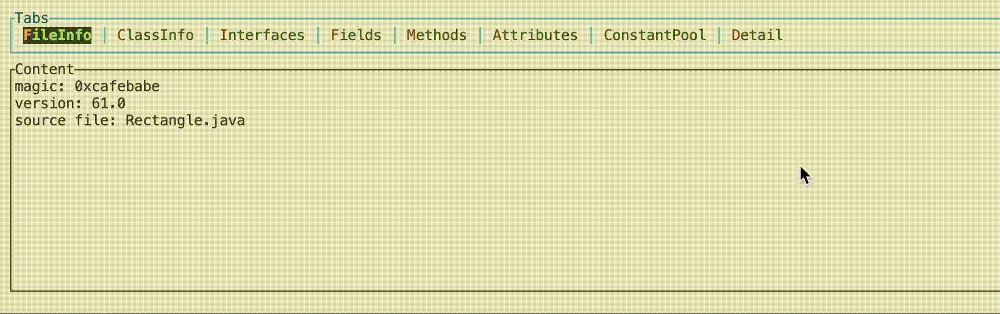

# Android Java Tools

a set of tools for android java development written in rust🦀.

## Features

- java class reader

## Thanks to 

- [gitui](https://github.com/extrawurst/gitui/tree/master)
- [java_class_parser](https://github.com/joshradin/java_class_parser/blob/main/crates/itest-common/build.rs)